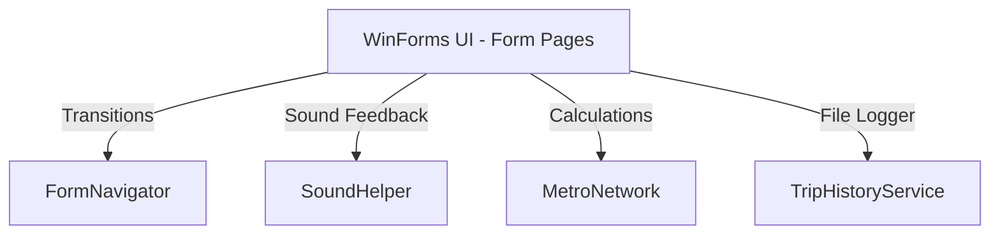

# About - Metro Navigation System

The **Metro Navigation System** is a Windows Forms desktop application built using C# and .NET Framework 4.7.2. It acts as an interactive route planner, map visualizer, and fare/receipt generator for a metropolitan transit network (specifically modeled around stations in Karachi).

---

## 1. System Architecture

The application is structured using a clean separation of concerns, separating the graphical user interface (Frontend) from the business logic and algorithms (Backend):



### 2. Frontend Navigation Framework
Instead of spawning multiple overlapping windows or causing resource leaks, the navigation is managed by a centralized, lightweight navigation helper class: [FormNavigator.cs](file:///d:/University%20Projects/Metro%20Navigation%20System%20(C%23)/FormNavigator.cs).

When moving between screens, `FormNavigator.ShowNext(Form currentForm, Form nextForm)` is invoked. It shows the target form and hides the current form. This ensures only one form remains active in the window stack at a given time:
```csharp
public static class FormNavigator
{
    public static void ShowNext(Form currentForm, Form nextForm)
    {
        nextForm.Show();
        currentForm.Hide();
    }
}
```

---

## 3. Backend Algorithms & Graph Theory

The route calculation is modeled as a shortest-path graph problem.

### Graph Data Representation
The transit network is represented as an edge-weighted undirected graph containing **10 vertices (Stations)**:
1. `Millennium Mall`
2. `Numaish`
3. `FTC`
4. `Frere Hall`
5. `KPT Interchange`
6. `Defence Morr`
7. `Indus Hospital`
8. `Shaan Chowrangi`
9. `Singer Chowrangi`
10. `Drigh Road`

These connections are stored in a 2D adjacency matrix within [MetroNetwork.cs](file:///d:/University%20Projects/Metro%20Navigation%20System%20(C%23)/MetroNetwork.cs). A value of `0` denotes no direct connection, while positive integers denote the edge weights (representing distance in kilometers):

```csharp
private static readonly int[,] Graph =
{
    { 0, 0, 0, 0, 0, 0, 0, 0, 0, 2 }, // Millennium Mall connects to Drigh Road (2km)
    { 0, 0, 0, 2, 0, 0, 0, 0, 0, 0 }, // Numaish connects to Frere Hall (2km)
    ...
};
```

### Dijkstra's Shortest Path Algorithm
To compute the optimal path between any start and end station, the backend executes **Dijkstra's Algorithm**:
1. **Initialize**: Sets distances from the starting station to all other stations as `int.MaxValue` (infinity), except for the starting station itself which is set to `0`. A `previous` tracker array is initialized to `-1` to keep track of backtracking paths.
2. **Greedy Traversal**: Selects the unvisited station with the smallest distance value (`GetNearestUnvisitedStation`).
3. **Relaxation**: Iterates through all neighbors of the current station. If the distance to the current station plus the edge weight is smaller than the previously recorded distance to the neighbor, it relaxes/updates the neighbor's distance table:
   $$D(v) = \min(D(v), D(u) + w(u, v))$$
4. **Backtracking Path Construction**: Once the destination station is reached or all reachable nodes are visited, the shortest path is reconstructed by traversing backwards from the destination to the source using the `previous` tracker array.

---

## 4. Helper Services

### File Logger (`TripHistoryService`)
The [TripHistoryService.cs](file:///d:/University%20Projects/Metro%20Navigation%20System%20(C%23)/TripHistoryService.cs) acts as a local file persistence engine. When a trip route is successfully computed, it formats a trip report and appends it to a history log file on the local filesystem under the directory:
`Metro App Travel History/`

The log records:
- Start Station
- End Station
- Total Distance (km)
- Timestamp of calculation

It also exposes `ReadLatestReceipt()` which parses the log file to return the receipt parameters for displaying on the receipt generation form.

### Sound Feedback (`SoundHelper`)
The [SoundHelper.cs](file:///d:/University%20Projects/Metro%20Navigation%20System%20(C%23)/SoundHelper.cs) class provides audio feedback for premium user interactions. Using the C# `System.Media.SoundPlayer` class, it loads and plays tap feedback sounds when buttons or options are selected, improving micro-interactions.
