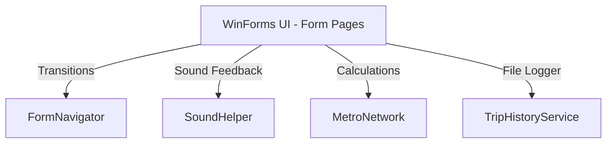

# Architecture Overview

The **Metro Navigation System** is a Windows Forms desktop application built with C# and .NET Framework 4.7.2. It acts as an interactive route planner, map visualizer, and fare/receipt generator for a metropolitan transit network (modeled around stations in Karachi).

All source code lives under [`src/MetroApp`](../../src/MetroApp).

## System Overview



## Navigation Framework

Instead of spawning multiple overlapping windows or causing resource leaks, screen transitions are managed by a centralized, lightweight navigation helper: [`FormNavigator.cs`](../../src/MetroApp/FormNavigator.cs).

When moving between screens, `FormNavigator.ShowNext(Form currentForm, Form nextForm)` is invoked. It shows the target form and hides the current one, ensuring only one form remains active in the window stack at a time:

```csharp
public static class FormNavigator
{
    public static void ShowNext(Form currentForm, Form nextForm)
    {
        nextForm.Show();
        currentForm.Hide();
    }
}
```

The wizard sequence flows: `Welcome` -> `Choices` -> `Metro Map` -> `Stations` -> `Shortest Path` -> `Receipt`.

## Route Calculation & Graph Theory

Route calculation is modeled as a shortest-path graph problem in [`MetroNetwork.cs`](../../src/MetroApp/MetroNetwork.cs).

### Graph Data Representation

The transit network is an edge-weighted undirected graph with 10 vertices (stations):

1. Millennium Mall
2. Numaish
3. FTC
4. Frere Hall
5. KPT Interchange
6. Defence Morr
7. Indus Hospital
8. Shaan Chowrangi
9. Singer Chowrangi
10. Drigh Road

These connections are stored in a 2D adjacency matrix, where `0` denotes no direct connection and positive integers denote edge weights (distance in kilometers):

```csharp
private static readonly int[,] Graph =
{
    { 0, 0, 0, 0, 0, 0, 0, 0, 0, 2 }, // Millennium Mall connects to Drigh Road (2km)
    { 0, 0, 0, 2, 0, 0, 0, 0, 0, 0 }, // Numaish connects to Frere Hall (2km)
    // ...
};
```

### Dijkstra's Shortest Path Algorithm

To compute the optimal path between any start and end station:

1. **Initialize** — distances from the starting station to all others are set to `int.MaxValue` (infinity), except the starting station itself (`0`). A `previous` tracker array is initialized to `-1` to support backtracking.
2. **Greedy traversal** — repeatedly selects the unvisited station with the smallest distance value (`GetNearestUnvisitedStation`).
3. **Relaxation** — for each neighbor of the current station, if the distance to the current station plus the edge weight is smaller than the neighbor's recorded distance, the neighbor's distance is updated:
   `D(v) = min(D(v), D(u) + w(u, v))`
4. **Path reconstruction** — once the destination is reached (or all reachable nodes are visited), the shortest path is rebuilt by walking backwards from the destination to the source using the `previous` tracker array.

## Helper Services

### Trip History Logger (`TripHistoryService`)

[`TripHistoryService.cs`](../../src/MetroApp/TripHistoryService.cs) is a local file persistence engine. When a route is computed, it formats a trip report and appends it to a history log under `Metro App Travel History/` next to the executable. Each entry records the start station, end station, total distance, and timestamp. It also exposes `ReadLatestReceipt()`, which parses the log to populate the receipt generation screen.

### Sound Feedback (`SoundHelper`)

[`SoundHelper.cs`](../../src/MetroApp/SoundHelper.cs) provides audio feedback using `System.Media.SoundPlayer`, playing a tap sound when buttons or options are selected.
